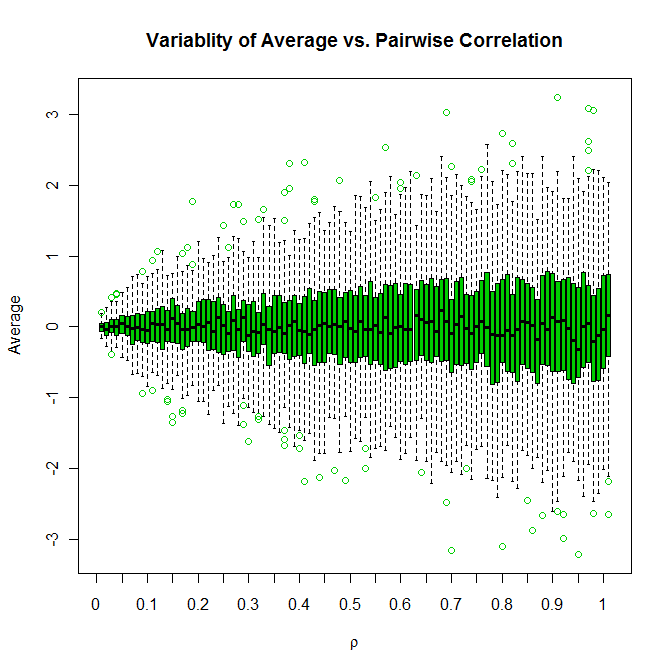

# A good modelling tool

.pull-left[

### <span style="color:MediumSeaGreen">At a minimum:</span>

* Applicable to classification and regression
    
* Competitive accuracy
    
* Capable of handling large data sets
    
* Handle missing values effectively

]

--

.pull-right[

### <span style="color:MediumSeaGreen">Bonus features:</span>

* Which variables are important?
    
* How do the variables interact?
    
* What is the shape of the data (i.e., how does it cluster?)
    
* How do the features separate classes?
    
* Are their **novel cases and outliers**?

]
    
--

<br/>

.right[-Leo Breiman]


---
class: inverse, center, middle

```{r setup, include=FALSE}
# Set global R options
options(htmltools.dir.version = FALSE)
options(servr.daemon = TRUE)

# Set global knitr chunk options
knitr::opts_chunk$set(
  fig.path = "figures/", cache = TRUE, dev = "svg",
  message = FALSE, warning = FALSE, collapse = FALSE, fig.align = "center"
)

# Load required packages
library(vip)
```

background-image: url(https://upload.wikimedia.org/wikipedia/commons/9/99/Fog_forrest_frickberg.jpg)

# Decision trees

???

Image credit: [Wikimedia Commons](https://commons.wikimedia.org/wiki/Forest#/media/File:Fog_forrest_frickberg.jpg)

---

# Mushroom classification

There is no simple rule for determining the edibility of a [mushroom](https://raw.githubusercontent.com/bgreenwell/MLDay18/master/data/mushroom.csv); no rules like **"leaflets three, let it be"**, **"hairy vine, no friend of mine"** and **"berries white, run in fright"** for poison ivy.

```{r, echo=FALSE, out.width="50%"}
knitr::include_graphics("figures/edible.jpg")
```

--

```{r mushroom-load, echo=TRUE}
path <- paste0("https://raw.githubusercontent.com/bgreenwell/",
               "MLDay18/master/data/mushroom.csv")
mushroom <- read.csv(path)
mushroom$veil.type <- NULL  # only takes on a single value  #<<
```


---

# Mushroom classification

```{r mushroom-setup, echo=TRUE}
# Load required packages
library(caret)  # for data splitting
library(rpart)  # for binary recursive partitioning

# Partition the data into train/test sets
set.seed(101)
trn_id <- createDataPartition(
  y = mushroom$Edibility, p = 0.5, list = FALSE
)
trn <- mushroom[trn_id, ]   # training data
tst <- mushroom[-trn_id, ]  # test data

# Function to calculate accuracy
accuracy <- function(pred, obs) {
  sum(diag(table(pred, obs))) / length(obs)
}
```


---

# Mushroom classification

.pull-left[

```{r mushroom-tree-1}
# Decision stump (test error = 0.54%):
cart1 <- rpart(
  Edibility ~ ., data = trn,
  control = rpart.control(maxdepth = 1) #<<
)

# Get test set predictions
pred1 <- predict(
  cart1, newdata = tst, 
  type = "class"
)

# Compute test set accuracy
accuracy(
  pred = pred1, 
  obs = tst$Edibility
)
```

]

.pull-right[

```{r mushroom-tree-2}
# Optimal tree (test error = 0%):
cart2 <- rpart(
  Edibility ~ ., data = trn, 
  control = list(cp = 0, minbucket = 1, minsplit = 1) #<<
)

# Get test set predictions
pred2 <- predict(
  cart2, newdata = tst, 
  type = "class"
)

# Compute test set accuracy
accuracy(
  pred = pred2, 
  obs = tst$Edibility
)
```

]


---

# Mushroom classification

.pull-left[

Shallow tree (test error = 1.53%):
```{r mushroom-tree-diagram-1, echo=FALSE, out.width="100%"}
# Load required packages
library(rpart.plot)

# Tree diagram (deep tree)
prp(cart1,
    type = 4,
    clip.right.labs = FALSE, 
    branch.lwd = 2,
    extra = 1, 
    under = TRUE,
    under.cex = 1.5,
    split.cex = 1.5,
    box.col = c("palegreen3", "pink")[cart1$frame$yval])
```

]

.pull-right[

Optimal tree (test error = 0%):
```{r mushroom-tree-diagram-2, echo=FALSE, out.width="100%"}
# Tree diagram (shallow tree)
prp(cart2,
    type = 4,
    clip.right.labs = FALSE, 
    branch.lwd = 2,
    extra = 1, 
    under = TRUE,
    under.cex = 1.5,
    split.cex = 1.5,
    box.col = c("palegreen3", "pink")[cart2$frame$yval])
```

]


---

# Mushroom classification

```{r mushroom-vi}
library(vip)  # variable importance plots (experimental)  #<<
vi(cart2)[1L:10L, ]  # variable importance scores (tibble)
```


---

# Mushroom classification

```{r mushroom-vip, out.width="55%"}
vip::vip(cart2, top_n = 10)  # variable importance plot (ggplot2)
```


---

# A handy rule for mushrooms

--

<br><br><br>
.right[<div class="centered">
<span style="color:Tomato"><font size="25">"If it smells bad, don't eat it!"</font></span>
</div>]
<br>
.right[-Decision Stump]


---

# Predicting email spam

.pull-left[

- Data from 4601 email messages collected at Hewlett-Packard Labs

- **Goal:** predict whether an email message is <span style="color:Tomato">spam</span> (junk email) or <span style="color:MediumSeaGreen ">ham</span> (good email)

- **Features:** relative frequencies in a message of 57 of the most commonly occurring words and punctuation marks in all the training the email messages

- For this problem, not all errors are equal; misclassifying <span style="color:Tomato">spam</span> is not as bad as misclassifying <span style="color:MediumSeaGreen">ham</span>!

]

.pull-right[

```{r fig-spam-300, echo=FALSE, out.width="100%"}
knitr::include_graphics("figures/this-is-spam.jpg")
```

]


---

# Predicting email spam (single tree)

```{r spam-tree}
# Load the data
data(spam, package = "kernlab") #<<

# Partition the data into train/test sets
set.seed(101)  # for reproducibility
trn_id <- createDataPartition(spam$type, p = 0.7, list = FALSE)
trn <- spam[trn_id, ]                # training data
tst <- spam[-trn_id, ]               # test data
xtrn <- subset(trn, select = -type)  # training data features
xtst <- subset(tst, select = -type)  # test data features
ytrn <- trn$type                     # training data response

# Fit a classification tree (cp found using k-fold CV)
spam_tree <- rpart(type ~ ., data = trn, cp = 0.00204) #<<
pred <- predict(spam_tree, newdata = xtst, type = "class")

# Compute test set accuracy
(spam_tree_acc <- accuracy(pred = pred, obs = tst$type))
```


---

# Predicting email spam (single tree)

```{r spam-tree-diagram, echo=FALSE, out.width="70%"}
# Tree diagram
prp(spam_tree,
    type = 4,
    clip.right.labs = FALSE, 
    branch.lwd = 2,
    extra = 1, 
    under = TRUE,
    under.cex = 1.5,
    split.cex = 1.5,
    box.col = c("palegreen3", "pink")[spam_tree$frame$yval])
```


---

# Predicting email spam (single tree)

.pull-left[

```{r spam-vi}
vi(spam_tree)
```

]

.pull-right[

```{r spam-vip, out.width="100%"}
vip(spam_tree, top_n = 10)
```

]


---

# How do trees measure up?

.pull-left[

### Advantages:

* <span style="color:MediumSeaGreen">Small trees are easy to interpret</span>

* <span style="color:MediumSeaGreen">Trees scale well to large $N$</span> (Fast!!)

* <span style="color:MediumSeaGreen">Can handle data of all types</span> (i.e., requires little, if any, coding)

* <span style="color:MediumSeaGreen">Automatic variable selection</span>

* <span style="color:MediumSeaGreen">Can handle missing data</span> (through *surrogate splits*)

* <span style="color:MediumSeaGreen">Completely nonparametric</span> (great for DM and EDA tasks!)

]

--

.pull-right[

### Disadvantages:

* <span style="color:Tomato">Large trees can be difficult to interpret</span>

* <span style="color:Tomato">Trees are step functions</span> (i.e., binary splits)

* <span style="color:Tomato">Greedy splitting algorithms</span> (i.e., trees are noisy)

* <span style="color:Tomato">All splits depend on previous splits</span> (i.e., high order interactions)

* <span style="color:Tomato">Data is essentially taken away after each split</span>

]


---

# How do trees measure up?

```{r fig-characteristics, echo=FALSE, out.width="65%"}
knitr::include_graphics("figures/esl-tbl.png")
```
<br>
.center[**Source:** The Elements of Statistical Learning, Second Edition]


---

## Creating ensembles of trees

- Bagging (simplest and has **zero tuning parameters!** `r emo::ji("sunglasses")`)

- Random forest (a slight modification over bagged decision trees)

- Boosting (can be more accurate, but **lots of tuning parameters!** `r emo::ji("scream")`)

<br><br>

<center>
<font size="8"><span style="color:DarkBlue">Boosting</span> >= <span style="color:MediumSeaGreen">Random forest</span> > <span style="color:MediumOrchid ">Bagging</span> > <span style="color:DarkOrange">Single tree</span></font>
</center>


---
class: inverse, center, middle

background-image: url(https://upload.wikimedia.org/wikipedia/commons/9/99/Fog_forrest_frickberg.jpg)

# Bagging

???

Image credit: [Wikimedia Commons](https://commons.wikimedia.org/wiki/Forest#/media/File:Fog_forrest_frickberg.jpg)


---

# Background

.pull-left[

* The key to accuracy is **low bias** AND **low correlation**!

* **B**ootstrap **agg**regat**ing**

    1. Sample records **with replacement**
    
    2. Fit model to resampled data set
    
    3. Repeat a large number of times ( $\ge 500$ , say)

]
 

.pull-right[

```{r fig-bagged-trees, echo=FALSE, out.width="80%"}
knitr::include_graphics("figures/millionaire.png")
```

]
* Predictions are combined by popular vote (**classification**) or averaging (**regression**)

* Same idea as "wisdom of the crowd" (<span style="color:purple">Francis Galton's Ox weight survey</span>)

* Improves the stability and accuracy of noisy models (e.g., individual trees)


---

# Bagging trees

```{r bagging-1, echo=FALSE, out.width="65%"}
# Simulate some sine wave data
set.seed(1112)  # for reproducibility
x <- seq(from = 0, to = 2 * pi, length = 100)
y <- sin(x) + rnorm(length(x), sd = 0.5)
plot(x, y)
lines(x, sin(x))
legend("topright", legend = "True function", lty = 1, inset = 0.01,
       box.col = "transparent")
```


---

# Trees are step functions

```{r bagging-2, echo=FALSE, out.width="65%"}
# Fit a single regression tree
fit <- rpart(y ~ x, cp = 0)
pred <- predict(fit)
plot(x, y)
lines(x, sin(x))
cols <- RColorBrewer::brewer.pal(9, "Set1")
lines(x, pred, col = cols[1L], lwd = 2)
lgnd <- c("True function", "Single tree")
legend("topright", legend = lgnd, col = c("black", cols[1L]), 
       lty = 1, inset = 0.01, box.col = "transparent")
```


---

# Trees are noisy

```{r bagging-3, echo=FALSE, out.width="65%"}
# Fit many regression trees to bootstrap samples
plot(x, y)
nsim <- 1000
pred_mat <- matrix(nrow = length(x), ncol = nsim)
set.seed(1145)  # for reproducibility
id <- replicate(nsim, sort(sample(length(x), replace = TRUE)))
for (i in 1:nsim) {
  fit <- rpart(y[id[, i]] ~ x[id[, i]], cp = 0)
  pred_mat[, i] <- predict(fit)
  lines(x[id[, i]], pred_mat[, i], 
        col = adjustcolor(cols[2L], alpha.f = 0.05))
}
lines(x, sin(x))
lines(x, pred, col = cols[1L], lwd = 2)
lgnd <- c("True function", "Single tree", "Bootstrapped tree")
legend("topright", legend = lgnd, col = c("black", cols[1L:2L]), 
       lty = 1, inset = 0.01, box.col = "transparent")
```


---

# Bagging reduces variance (of noisy models)

```{r bagging-4, echo=FALSE, out.width="65%"}
plot(x, y)
for (i in 1:nsim) {
  lines(x[id[, i]], pred_mat[, i], 
        col = adjustcolor(cols[2L], alpha.f = 0.05))
}
lines(x, sin(x))
lines(x, pred, col = cols[1L], lwd = 2)
lines(x, apply(pred_mat, MARGIN = 1, FUN = mean), col = cols[6L], lwd = 2)
lgnd <- c("True function", "Single tree", "Bootstrapped tree", "Averaged trees")
legend("topright", legend = lgnd, col = c("black", cols[c(1, 2, 6)]), lty = 1, 
       inset = 0.01, box.col = "transparent")
```


---

# Predicting email spam (bagging)

.pull-left[

```{r}
# Load required packages
library(randomForest)

# Fit a bagger model
set.seed(1633)  # for reproducibility
spam_bag <- randomForest(
  type ~ ., 
  data = trn, 
  ntree = 250,
  mtry = ncol(xtrn),  # use all available features #<<
  xtest = subset(tst, select = -type),
  ytest = tst$type,
  keep.forest = TRUE
)
```

]

.pull-right[

```{r, echo=FALSE, out.width="400"}
# Compute test error
pred <- predict(spam_bag, newdata = xtst, type = "class")
spam_bag_acc <- accuracy(pred = pred, obs = tst$type)

# Plot test error
dark2 <- RColorBrewer::brewer.pal(8, "Dark2")
par(mar = c(4, 4, 0.1, 0.1))
plot(seq_len(spam_bag$ntree), spam_bag$test$err.rate[, "Test"], type = "l", 
     col = dark2[1L], ylim = c(0.04, 0.11), las = 1,
     ylab = "Test error", xlab = "Number of trees")
abline(h = 1 - spam_tree_acc, lty = 2, col = "black")
abline(h = 1 - spam_bag_acc, lty = 2, col = dark2[1L])
legend("topright", c("Single tree", "Bagging"),
       col = c("black", dark2[1L]), lty = c(2, 1), lwd = 1)
```

]


---
class: inverse, center, middle

background-image: url(https://upload.wikimedia.org/wikipedia/commons/9/99/Fog_forrest_frickberg.jpg)

# Random forest

???

Image credit: [Wikimedia Commons](https://commons.wikimedia.org/wiki/Forest#/media/File:Fog_forrest_frickberg.jpg)


---

# Background

* Correlation limits the effect of bagging

--

```{r correlation, echo=FALSE, out.width="60%"}

```


---

# Background

* **Bagging on steroids!!**

* Grow trees just as in bagging, but with a small twist

    - At each split in each tree in the forest, select a subset of the predictors as candidate splitters
    
      - This essentially **"decorrelates" the trees!**
    
    - The number of randomly selected variables, denoted $m_{try}$, is a **tuning parameter** (really the only tuning parameter in a random forest)

* Bagging introduces randomness into the rows of the data

* Random forests introduce randomness into the rows and columns of the data


---

# Random forest packages in R

.pull-left[

* <span style="color:MediumSeaGreen">`randomForest`</span>

    - The standard (implements most **bells and whistles**; great for EDA!!)

* <span style="color:MediumSeaGreen">`randomForestSRC`</span>

    - Survival, regression and classification (including ***competing risks***)

* <span style="color:MediumSeaGreen">`ranger`</span>

    - Survival, regression and classification (**Fast and suitable for high-dimensional problems!**)
    
    - Oh, and **estimated time to completion!!** `r emo::ji("money")`

]

.pull-right[

* <span style="color:MediumSeaGreen">`party`/`partykit`</span>

    - Unbiased variable selection

* <span style="color:MediumSeaGreen">`bigrf`</span>

    - **ORPHANED** (classification only)

* <span style="color:MediumSeaGreen">`Rborist`</span>

    - Parallelizable

* <span style="color:MediumSeaGreen">`h2o`</span>

    - Distributd random forests (**can be stacked with other `h2o` models!!**)

]


---

# Predicting email spam (random forest)

.pull-left[

```{r}
# Load required packages
library(randomForest)

# Fit a bagger model
set.seed(1633)  # for reproducibility
spam_rf <- randomForest(
  type ~ ., 
  data = trn, 
  ntree = 250,
  mtry = 7,  # floor(sqrt(p))  #<<
  xtest = subset(tst, select = -type),
  ytest = tst$type,
  keep.forest = TRUE
)
```

]

.pull-right[

```{r, echo=FALSE, out.width="400"}
# Compute test error
pred <- predict(spam_rf, newdata = xtst, type = "class")
spam_rf_acc <- accuracy(pred = pred, obs = tst$type)

# Plot test error
par(mar = c(4, 4, 0.1, 0.1))
plot(seq_len(spam_rf$ntree), spam_rf$test$err.rate[, "Test"], type = "l", 
     col = dark2[4L], ylim = c(0.04, 0.11), 
     ylab = "Test error", xlab = "Number of trees")
lines(seq_len(spam_rf$ntree), spam_bag$test$err.rate[, "Test"], col = dark2[1L])
abline(h = 1 - spam_tree_acc, lty = 2, col = "black")
abline(h = 1 - spam_bag_acc, lty = 2, col = dark2[1L])
abline(h = 1 - spam_rf_acc, lty = 2, col = dark2[4L])
legend("topright", c("Single tree", "Bagging", "Random forest"),
       col = c("black", dark2[c(1, 4)]), lty = c(2, 1, 1), lwd = 1)
```

]


---

.pull-left[

### <span style="color:MediumSeaGreen">Advantages:</span>

* Competitive accuracy

* *out-of-bag* data

* Free cross-validation

* Variable importance

* Supervised and unsupervised

* Deep trees (**Proximity matrix!!**)

    - Novel cases and outliers
    
    - MDS
    
    - Interaction detection (least implemented)
    
    - Missing value imputation

]

.pull-right[

### <span style="color:Tomato">Disadvantages:</span>

* Missing values (**why?**)

* Can be slow on large data sets (deep trees)!

```{r fig-bells-and-whistles, echo=FALSE, out.width="100%"}
knitr::include_graphics("figures/bells-and-whistles.jpg")
```

]


---

# Out-of-bag data

* For large enough $N$, on average, $1 - e^{-1} \approx 63.21$% or the original records end up in any bootstrap sample

* Thus, roughly $e^{-1} \approx 36.79$% of the original observations are not used in the construction of a particular tree

* These observations are considered *out-of-bag* (OOB) and can be usd to

    - Provide an unbiased error estimates (**sort of an unstructured, but free, cross-validation**)
 
    - Construct a novel variable importance measure based on the **predictive strength** of each feature!!


---
class: center, middle

```{r, echo=FALSE, out.width="80%"}
# Compute test error
pred <- predict(spam_rf, newdata = xtst, type = "class")
spam_rf_acc <- accuracy(pred = pred, obs = tst$type)

# Plot test error
par(mar = c(4, 4, 0.1, 0.1))
plot(seq_len(spam_rf$ntree), spam_rf$test$err.rate[, "Test"], type = "l", 
     col = dark2[4L], ylim = c(0.04, 0.11), 
     ylab = "Error estimate", xlab = "Number of trees")
lines(seq_len(spam_rf$ntree), spam_rf$err.rate[, "OOB"], type = "l", 
     col = dark2[1L])
abline(h = spam_rf$err.rate[spam_rf$ntree, "OOB"], lty = 2, col = dark2[1L])
abline(h = 1 - spam_rf_acc, lty = 2, col = dark2[4L])
legend("topright", c("Bagging (OOB)", "Random forest (test)"),
       col = c(dark2[c(1, 4)]), lty = c(1, 1))
```


---

# OOB-based variable importance

* **Traditional approach:** Average variable importance scores (i.e., total goodness of split) over all trees 

* **Novel approach:** To estimate the importance of the $k$-th variable ($x_k$):

  1. Record the OOB performance of the model
  
  2. Randomly permute all the values of $x_k$ in the OOB data
  
  3. Recompute the OOB performance of the model
  
  4. The difference between the two OOB performance measures the strength of the structural importance of $x_k$
  
* Fundamentally different as these importance scores are **NOT** based on data seen by the individual trees!


---

# Boston housing example

* Housing data from $N = 506$ census tracts in the city of Boston for the year 1970

* The data violate many classical assumptions like linearity, normality, and constant variance

--

* Harrison and Rubinfeld's housing value equation ( $R^2 = 0.81$ ):

```{r, echo=FALSE, out.width="80%"}
knitr::include_graphics("figures/boston-eqn.png")
```

--

* Nowadays, many supervised learning algorithms can fit the data automatically in seconds---typically with higher accuracy!

* The downfall, however, is some loss of interpretation since these algorithms typically do not produce simple prediction formulas (**but there's still hope!** `r emo::ji("pray")`)


---

```{r boston-ranger}
# Load required packages
library(ranger)

# Load the (corrected) Boston housing data
data(boston, package = "pdp")
```

.pull-left[

```{r boston-rf-timing}
# Using the randomForest package
set.seed(2007)  # for reproducibility
system.time(
  boston_rf <- randomForest(
    cmedv ~ ., data = boston, 
    ntree = 5000,
    mtry = 5,
    importance = FALSE
  )
)
```
```{r, echo=FALSE}
boston_rf$rsq[boston_rf$ntree]
```

]

.pull-right[

```{r boston-ranger-timing}
# Using the ranger package
set.seed(1652)  # for reproducibility
system.time(
  boston_ranger <- ranger(
    cmedv ~ ., data = boston, 
    num.trees = 5000, 
    mtry = 5,  # :/  #<<
    importance = "impurity"
  )
)
```
```{r, echo=FALSE}
boston_ranger$r.squared
```

]

```{r boston-rf, echo=FALSE}
# Refit models with less trees
set.seed(1453)  # for reproducibility
boston_rf <- randomForest(cmedv ~ ., data = boston, ntree = 500,
                          importance = TRUE, proximity = TRUE)
boston_ranger <- ranger(cmedv ~ ., data = boston, num.trees = 500,
                        importance = "impurity")
```


---

# Variable importance plots: `vip`

.pull-left[

* Most RF packages provide variable importance measures, but not all of them provide variable importance plots (VIPs)

* The `vip` package provides a consistent framework for extracting and plotting variable importance scores from many types of ML models (not just RFs)

* `vi()` always returns a `tibble`

* `vip()` always returns a `ggplot2` object

]

.pull-right[

```{r vip-install, eval=FALSE}
# Not yet on CRAN (experimental)
devtools::install_github("AFIT-R/vip")
```

```{r vip-badge, echo=FALSE, out.width="80%"}
knitr::include_graphics("../devel/vip/tools/vip-logo.png")
```
]


---

```{r boston-rf-varImpPlot, fig.width=6, fig.height=4, out.width="100%"}
par(mfrow = c(1, 2))
varImpPlot(boston_rf)
```


---

```{r boston-rf-vip, fig.width=9, fig.height=4, out.width="100%"}
# Load required packages
library(vip)  # for better (and consistent) variable importance plots

# Construct variable importance plots
p1 <- vip(boston_rf, type = 1) + ggtitle("randomForest")
p2 <- vip(boston_rf, type = 2) + ggtitle("randomForest")
p3 <- vip(boston_ranger) + ggtitle("ranger")
grid.arrange(p1, p2, p3, ncol = 3)
```


---

# Partial dependence plots

* Constructing a PDP in practice is rather straightforward!! `r emo::ji("sunglasses")`

* Let $x_1$ be the predictor variable of interest with unique values $\left\{x_{11}, x_{12}, \dots, x_{1k}\right\}$

* The partial dependence of the response on $x_1$ can be constructed as follows:

    1. For $i \in \left\{1, 2, \dots, k\right\}$:
    
        a. Copy the training data and replace the original values of $x_1$ with the constant $x_{1i}$
    
        b. Compute the vector of predicted values from the modified copy of the training data
        
        c. Compute the average prediction to obtain $\bar{f}_1\left(x_{1i}\right)$

    2. Plot the pairs $\left\{x_{1i}, \bar{f}_1\left(x_{1i}\right)\right\}$ for $i = 1, 2, \dotsc, k$


---

# Partial dependence plots: `pdp`

.pull-left[

* Not all RF implementations provide support for constructing PDPs

* The `pdp` package:

    - Provides a consistent way of constructing PDPs (and more) from many types of ML models (not just RFs)

    - Allows for multivariate displays (i.e., interactions) and so much more!!

* Read the paper: https://journal.r-project.org/archive/2017/RJ-2017-016/index.html

]

.pull-right[

```{r, eval=FALSE}
# Install from CRAN
install.packages("pdp")

# Install from GitHub
devtools::install_github("bgreenwell/pdp")
```

```{r, echo=FALSE, out.width="80%"}
knitr::include_graphics("../devel/pdp/tools/pdp-logo.png")
```

]


---

# Partial dependence plots: `pdp`

```{r boston-rf-pdps, fig.width=12, fig.height=4, out.width="100%"}
# Load required packages
library(pdp)

# PDPs for the top two predictors
p1 <- partial(boston_ranger, pred.var = "lstat", plot = TRUE)
p2 <- partial(boston_ranger, pred.var = "rm", plot = TRUE)
p3 <- partial(boston_ranger, pred.var = c("lstat", "rm"),  #<<
              chull = TRUE, plot = TRUE)                   #<<
grid.arrange(p1, p2, p3, ncol = 3)
```


---

# Partial dependence plots: `pdp`

**3-D plots:**
```{r, echo=TRUE}
pd <- attr(p3, "partial.data")  # no need to recalculate #<<
p1 <- plotPartial(pd, 
  levelplot = FALSE, drape = TRUE, colorkey = FALSE,
  screen = list(z = -20, x = -60)
)
```

**ggplot2-based graphics:**
```{r, echo=TRUE}
library(ggplot2)
p2 <- autoplot(pd)
```

**ICE and c-ICE curves:**
```{r, echo=TRUE}
p3 <- boston_ranger %>%  # %>% is automatically imported!
  partial(pred.var = "rm", ice = TRUE, center = TRUE) %>%
  autoplot(alpha = 0.1)
```


---

# Partial dependence plots: `pdp`

```{r, echo=FALSE, fig.width=12, fig.height=4, out.width="100%"}
# Display all three plots side-by-side
grid.arrange(p1, p2, p3, ncol = 3)
```


---

# Proximity matrix

* One of the most useful tools in random forests

* In random forests (and bagging), **trees are intentionally grown deep**!


---

```{r mushroom-tree-diagram-3, echo=FALSE, out.width="80%"}
# Tree diagram (shallow tree)
prp(cart2,
    type = 4,
    clip.right.labs = FALSE, 
    branch.lwd = 2,
    extra = 1, 
    under = TRUE,
    under.cex = 1.5,
    split.cex = 1.5,
    box.col = c("palegreen3", "pink")[cart2$frame$yval])
```


---

# Proximity matrix

* One of the most useful tools provided by random forests

* In random forests (and bagging), **trees are intentionally grown deep**!

    1. Initialize the proximity between cases $i$ and $j$ to zero: $prox_{ij} = 0$

    2. After a tree is grown, put all of the data, both training and OOB, down the tree

    3. If cases $i$ and $j$ land in the same terminal node, increase $prox_{ij}$ by one

    4. At the end, normalize $prox_{ij}$ by dividing by the number of trees in the forest

* The pairwise proximities can be used to construct a useful distance matrix

* **Requires the storage of an $N \times N$ matrix!!** `r emo::ji("scream")`


---

# Swiss banknote data

```{r banknote-rf}
# Load the data
data(banknote, package = "alr3")

# Fit a random forest
set.seed(1701)  # for reproducibility
banknote_rf <- randomForest(
  as.factor(Y) ~ ., 
  data = banknote, 
  proximity = TRUE  #<<
)

# Print the OOB confusion matrix
banknote_rf$confusion
```


---

# Proximity matrix

```{r heatmap, out.width="60%"}
heatmap(banknote_rf$proximity, col = viridis::plasma(256))
```


---

# Outlier scores

.pull-left[

```{r outlier, eval=FALSE}
# Dot chart of outlier scores
outlyingness <- tibble(
  "out" = outlier(banknote_rf),  #<<
  "obs" = seq_along(out),
  "class" = as.factor(banknote$Y)
)
ggplot(outlyingness, aes(x = obs, y = out)) +
  geom_point(aes(color = class, size = out), alpha = 0.5) +
  geom_hline(yintercept = 10, linetype = 2) +
  labs(x = "Observtion", y = "Outlyingness")
  theme_light() +
  theme(legend.position = "none")
```

]

.pull-right[

```{r outlier-plot, echo=FALSE, out.width="100%"}
outlyingness <- tibble::tibble(
  "out" = outlier(banknote_rf), 
  "obs" = seq_along(out),
  "class" = as.factor(banknote$Y)
)
ggplot(outlyingness, aes(x = obs, y = out)) +
  geom_point(aes(color = class, size = out), alpha = 0.5) +
  geom_hline(yintercept = 10, linetype = 2) +
  labs(x = "Observtion", y = "Outlyingness") +
  theme_light() +
  theme(legend.position = "none")
```

]


---

# Multi-dimensional scaling

```{r MDS, out.width="50%"}
MDSplot(banknote_rf, fac = as.factor(banknote$Y), k = 2, cex = 1.5)
```


---

# Missing value imputation

* Random forest offers a novel approach to imputing missing values (i.e., `NA`s)

    1. Start with cheap imputation (e.g., median for continuous features)
    
    2. Run a random forest and obtain the proximity matrix
    
    3. Imputed values are updated using:
    
        - The weighted average of the non-missing observations, where the weights are the proximity (**continuous**)
        
        - The category with the largest average proximity (**categorical**)

    4. Iterate this procedure until convergence (~ 4-6 times seems sufficient)

* Highly computational (requires many random forest runs!!)

* Resulting **OOB error estimate tends to be overly optimistic** 


---
class: inverse, center, middle

background-image: url(https://upload.wikimedia.org/wikipedia/commons/9/99/Fog_forrest_frickberg.jpg)

# Boosting

???

Image credit: [Wikimedia Commons](https://commons.wikimedia.org/wiki/Forest#/media/File:Fog_forrest_frickberg.jpg)


---

# Background

* Boosting is a general technique to create an ensemble of models (*meta-algorithm*)

* In contrast to bagging, boosting:

    - uses a *weak learner* for each model
    
    - builds the models sequentially (fix past mistakes)
    
* Most commonly used with decision trees (e.g., *decision stumps*), but other types of models can be boosted

* Boosting requires more tuning, but is typically faster and more accurate than RFs!

* Many variants: AdaBoost, gradient boosting, and stochastic gradient boosting (GBM), for example


---

# Stochastic gradient boosting

* Stochastic gradient boosting is the most general and widely used

* Allows for arbitrary differentiable loss functions (**generalized**)

* Introduces subsampling into the rows and columns (**stochastic**)

* Loss function is optimized using *gradient descent* (**gradient**)

* With the right combination of parameters, GBMs can emulate RFs!

* Popular R package for boosting: `gbm`, `gbm3`, `xgboost`, and `lightgbm`

* Check out the [machine learning task view](https://cran.r-project.org/web/views/MachineLearning.html)!


---

# Lots of tuning parameters

* Size of trees (controls interaction depth)

* Learning rate (shrinkage for regularization)

* Number of trees

* Minimum leaf size

* Subsampling fraction

* **And many more depending on the implementation!** (ya, I'm talking about you, `xgboost` `r emo::ji("smug")`)


---

# Essential algorithm

* Iteratively learning a set of weak models on subsets of the data

* Weighing each weak prediction according to each weak learner's performance

* Combine the weighted predictions to obtain a single weighted prediction

$$F_m\left(x\right) = F_{m - 1}\left(x\right) + v \times\gamma_m h_m\left(x\right), \quad 0 < v \le 1$$

* [R code for gradient boosted regression trees with squared-error loss](https://github.com/bgreenwell/MLDay18/blob/master/code/rpartBoost.R)

---
class: center, middle

# Boosting regression stumps [R code](https://github.com/bgreenwell/MLDay18/blob/master/code/rpartBoost.R)


---

# GBM packages in R

* `gbm`: **g**eneralized **b**oosted **m**odels

    - The original R implementation of GMBs (by Greg Ridgeway)
    
    - Slower than modem implementations (but still pretty fast)
    
    - Currently orphaned on CRAN (for now)
    
* `gbm3`: **g**eneralized **b**oosted **m**odels 

    - Shiny new version of `gbm` that is not backwards compatible
    
    - Faster and supports parallel tree building
    
    - Not currently listed on CRAN

* `xgboost`: R interface to XGBoost for <span style="color:DeepSkyBlue">eXtreme Gradient Boosting</span>

* `lightgbm`: Microsoft supported **?**competitor to `xgboost`**?**

* `mboost`: **m**odel-based **boost**ing


---

# Missing values

* Unlike RFs, GBMs typically support missing values!

* In most GBM implementations, `NA`s are interpreted as containing information (i.e., missing for a reason), rather than missing at random

    - In `gbm` and `gbm3`, a separate branch is created at each split for `NA`s (i.e., each decision node contains three splits: left, right, and missing)
    
    - In `h2o` and `xgboost` each split has a **default direction** that is learned during training (`NA`s take the default route!)


---

# Boston housing example

```{r boston_gbm}
# Load required packages
library(gbm)

# Fit a GBM to the Boston housing data
set.seed(1053)  # for reproducibility
boston_gbm <- gbm(
  cmedv ~ ., 
  data = boston, 
  var.monotone = NULL,        #<<
  distribution = "gaussian",  # "benoulli", "coxph", etc. #<<
  n.trees = 10000,            #<<
  interaction.depth = 5,      #<<
  n.minobsinnode = 10,        #<<
  shrinkage = 0.005,          #<<
  bag.fraction = 1,           #<<
  train.fraction = 1,         #<<
  cv.folds = 10
)
```


---

# Boston housing example

```{r boston_gbm_best, out.width="50%"}
best_iter <- gbm.perf(
  boston_gbm, 
  method = "cv"  # or "OOB" or "test" #<<
)
```

---

# GBMs and PDPs

* PDPs can be slow to construct using the brute force method (**it involves making multiple copies of the training data!!**)
    
* The exception is decision trees based on single-variable splits which can make use of the efficient *weighted tree traversal method* described in Friedman (2001)

    - However, only the `gbm` and `gbm3` packages utilize this approach 

    - The `pdp` package:

        - Also exploits this strategy when used with `gbm` models

        - Has the option to construct PDPs in parallel using any parallel back end supported by the `foreach` package

        - Allows for user specified grids (e.g., plotting over the deciles of a feature is much faster and often sufficient to reveal functional relationships!)


---

.pull-left[

### Brute force method:
```{r randomForest-pdp-timing}
system.time(
  pd1 <- partial(
    boston_gbm, 
    pred.var = c("lon", "nox"),
    recursive = FALSE,  #<<
    chull = TRUE, 
    n.trees = best_iter  #<<
  )
)
```

]

.pull-right[

### Weighted tree traversal method:
```{r gbm-pdp-timing}
system.time(
  pd2 <- partial(
    boston_gbm, 
    pred.var = c("lon", "nox"),
    recursive = TRUE,  #<<
    chull = TRUE, 
    n.trees = best_iter  #<<
  )
)
```

]


---

```{r boston-pdps, fig.width=8, fig.height=4}
# Display plots side-by-side
grid.arrange(autoplot(pd1), autoplot(pd2), ncol = 2)
```


---

# Ames housing data

.pull-left[

* A contemporary alternative to the often cited Boston housing data

* Contains the sale of individual residential property in Ames, Iowa from 2006 to 2010

* Contains $N = 2930$ observations and $p = 80$ features involved in assessing home values

* Lots of potential for *feature engineering*!!

]

.pull-right[

```{r ames-densities, out.width="70%"}
ames <- AmesHousing::make_ames()
ggplot(ames, aes(x = Sale_Price, y = Overall_Qual)) + 
  ggridges::geom_density_ridges(aes(fill = Overall_Qual)) +  #<<
  scale_x_continuous(labels = scales::dollar) +
  labs(x = "Sale price", y = "Overall quality") +
  theme_light() + theme(legend.position = "none")
```

**Source:** [Bradley Boehmke](https://github.com/bradleyboehmke)

]


---

# <span style="color:DeepSkyBlue">eXtreme Gradient Boosting</span>

* Widely used by data scientists to achieve **state-of-the-art** results across many machine learning challenges (e.g., **Kaggle**)

* Designed to be highly **efficient**, **flexible**, and **portable**

* Parallel tree boosting and **GPU support with fast histogram method!!**

```{r gpu, echo=FALSE, out.width="50%"}
knitr::include_graphics("figures/gpu.jpg")
```

* **Supports early stopping!!**


---

```{r ames-xgboost}
# Load required packages
library(xgboost)

# Construct data set
ames <- AmesHousing::make_ames()

# Feature matrix  # or xgb.DMatrix or sparse matrix
X <- data.matrix(subset(ames, select = -Sale_Price))

# Fit an XGBoost model
set.seed(203)  # for reproducibility
ames_xgb <- xgboost(
  data = X, 
  label = ames$Sale_Price, 
  objective = "reg:linear",
  nrounds = 500, 
  max_depth = 5, 
  eta = 0.1, 
  subsample = 1,          #<<
  colsample = 1,          #<<
  num_parallel_tree = 1,  #<<
  eval_metric = "rmse",   #<<
  verbose = 0,
  save_period = NULL      #<<
)
```


---

# Ames housing data

```{r xgboost-vi}
# Variable importance scores
vi(ames_xgb, pred.var = colnames(X), type = "Gain")
```


---

# Ames housing data

```{r xgboost-vip, fig.width=12, fig.height=4}
# Variable importance plots
p1 <- vip(ames_xgb, pred.var = colnames(X), type = "Gain")
p2 <- vip(ames_xgb, pred.var = colnames(X), type = "Cover")
p3 <- vip(ames_xgb, pred.var = colnames(X), type = "Frequency")
grid.arrange(p1, p2, p3, ncol = 3)
```


---

# Ames housing data

```{r xgboost-vip-2, out.width="50%"}
# By default, `vip()` plots the top 10 features
vip(ames_xgb, pred.var = colnames(X), type = "Gain", 
    top_n = nrow(X), bar = FALSE)
```


---

# Ames housing data

```{r xgboost-pdp, fig.width=12, fig.height=4}
# Partial dependence plots
oq_ice <- partial(ames_xgb, pred.var = "Overall_Qual", ice = TRUE, 
                  center = TRUE, train = X)
p4 <- autoplot(partial(ames_xgb, pred.var = "Gr_Liv_Area", train = X))
p5 <- autoplot(partial(ames_xgb, pred.var = "Garage_Cars", train = X))
p6 <- autoplot(oq_ice, alpha = 0.1)
grid.arrange(p4, p5, p6, ncol = 3)
```


---

# Ames housing data


```{r xgboost-pdp-vi, echo=FALSE, fig.width=9, fig.height=6}
# Partial dependence plots for the top/bottom three features
ames_vi <- vi(ames_xgb, pred.var = colnames(X), type = "Gain")
feats <- c(head(ames_vi, n = 3)$Variable, tail(ames_vi, n = 3)$Variable)
pds <- lapply(feats, FUN = function(x) {
  pd <- cbind(x, partial(ames_xgb, pred.var = x, train = X))
  names(pd) <- c("xvar", "xval", "yhat")
  pd
})
pds <- do.call(rbind, pds)
ggplot(pds, aes(x = xval, y = yhat)) +
  geom_line(size = 1.5) +
  geom_hline(yintercept = mean(ames$Sale_Price), linetype = 2, col = "red2") +
  facet_wrap( ~ xvar, scales = "free_x") +
  labs(x = "", y = "Partial dependence") +
  theme_light()
```


---

# Questions?

```{r, echo=FALSE, out.width="100%"}
knitr::include_graphics("figures/questions.png")
```
