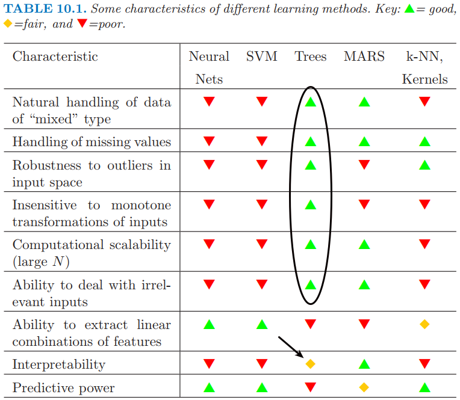

## R package prerequisites

.scrollable[

```{r r-prerequisites, eval=FALSE}

# Install required packages from CRAN
install.packages(
  "AmesHousing",   # for Ames housing data
  "caret",         # for data splitting function
  "gbm",           # for generalized boosted models
  "ggplot2",       # for nicer graphics
  "kernlab",       # for email spam data
  "pdp",           # for partial dependence plots
  "ranger",        # for faster random forest
  "randomForest",  # for classic random forest
  "RColorBrewer",  # for nicer looking color palettes 
  "rpart",         # for binary recursive partioning (i.e., CART)
  "tibble",        # for nicer data frames
  "xaringan",      # for building this presentation
  "xgboost"        # for eXtreme Gradient Boosting
)

# Install required packages from GitHub
devtools::install_github("AFIT-R/vip")  # for variable importance plots
```

]


---

## Data set information

.scrollable[

.pull-left[

### Classification:

* [mushroom](https://archive.ics.uci.edu/ml/datasets/mushroom)

    - 21 physical characteristics on 8124 mushrooms classified as either <span style="color:Tomato">poisonous</span> or <span style="color:MediumSeaGreen">edible</span>

* [spam](http://search.r-project.org/library/kernlab/html/spam.html)

    - 57 variables on 4601 emails classified as <span style="color:Tomato">spam</span>  or <span style="color:MediumSeaGreen">ham</span> 

* [banknote](http://search.r-project.org/library/alr3/html/banknote.html)

    - Six measurements made on 100 <span style="color:MediumSeaGreen">genuine</span>  Swiss banknotes and 100 <span style="color:Tomato">counterfeit</span>  ones

]

.pull-right[

### Regression:

* [boston](http://search.r-project.org/library/pdp/html/boston.html)

    - Data on median housing values from 506 census tracts in the suburbs of Boston from the 1970 census

* [ames](https://www.kaggle.com/c/house-prices-advanced-regression-techniques)

    - Data describing the sale of individual residential property in Ames, Iowa
from 2006 to 2010

]

]


---

## A good modelling tool

.pull-left[

### <span style="color:MediumSeaGreen">At a minimum:</span>

* Applicable to classification and regression
    
* Competitive accuracy
    
* Capable of handling large data sets
    
* Handle missing values effectively

]

--

.pull-right[

### <span style="color:MediumSeaGreen">Bonus features:</span>

* Which predictors are important? ([`vip`](https://github.com/AFIT-R/vip))

* How do the predictors functionally relate to the response? ([`pdp`](https://journal.r-project.org/archive/2017/RJ-2017-016/index.html))
    
* How do the predictors interact? ([`pdp`](https://journal.r-project.org/archive/2017/RJ-2017-016/index.html), [`vip`](https://github.com/AFIT-R/vip))
    
* What is the shape of the data (i.e., how does it cluster?)
    
* Are their novel cases and outliers?

]
    

---
class: inverse, center, middle

```{r setup, include=FALSE}
# Set global R options
options(htmltools.dir.version = FALSE)
options(servr.daemon = TRUE)

# Set global knitr chunk options
knitr::opts_chunk$set(
  fig.align = "center",
  fig.path = "figures/", 
  cache = TRUE,
  dev = "svg",
  error = FALSE,
  message = FALSE, 
  warning = FALSE, 
  collapse = FALSE 
)

# Load required packages
library(vip)
```

background-image: url(https://upload.wikimedia.org/wikipedia/commons/9/99/Fog_forrest_frickberg.jpg)

# Decision trees

???

Image credit: [Wikimedia Commons](https://commons.wikimedia.org/wiki/Forest#/media/File:Fog_forrest_frickberg.jpg)

---

## Mushroom classification

There is no simple rule for determining the edibility of a [mushroom](https://raw.githubusercontent.com/bgreenwell/MLDay18/master/data/mushroom.csv); no rules like **"leaflets three, let it be"**, **"hairy vine, no friend of mine"** and **"berries white, run in fright"** for poison ivy.

```{r, echo=FALSE, out.width="50%"}
knitr::include_graphics("figures/edible.jpg")
```

--

```{r mushroom-load, echo=TRUE}
path <- paste0("https://raw.githubusercontent.com/bgreenwell/",
               "MLDay18/master/data/mushroom.csv")
mushroom <- read.csv(path)  # load the data from GitHub
mushroom$veil.type <- NULL  # only takes on a single value  #<<
```


---

## Mushroom classification

```{r mushroom-setup, echo=TRUE}
# Load required packages
library(caret)  # for data splitting function
library(rpart)  # for binary recursive partitioning

# Partition the data into train/test sets
set.seed(101)
trn_id <- createDataPartition(
  y = mushroom$Edibility, p = 0.5, list = FALSE
)
trn <- mushroom[trn_id, ]   # training data
tst <- mushroom[-trn_id, ]  # test data

# Function to calculate accuracy
accuracy <- function(pred, obs) {
  sum(diag(table(pred, obs))) / length(obs)
}
```


---

## Mushroom classification

.pull-left[

```{r mushroom-tree-1}
# Decision stump (test error = 1.53%):
cart1 <- rpart(
  Edibility ~ ., data = trn,
  control = rpart.control(maxdepth = 1) #<<
)

# Get test set predictions
pred1 <- predict(
  cart1, newdata = tst, 
  type = "class"
)

# Compute test set accuracy
accuracy(
  pred = pred1, 
  obs = tst$Edibility
)
```

]

.pull-right[

```{r mushroom-tree-2}
# Optimal tree (test error = 0%):
cart2 <- rpart(
  Edibility ~ ., data = trn, 
  control = list(cp = 0, minbucket = 1, minsplit = 1) #<<
)

# Get test set predictions
pred2 <- predict(
  cart2, newdata = tst, 
  type = "class"
)

# Compute test set accuracy
accuracy(
  pred = pred2, 
  obs = tst$Edibility
)
```

]

```{r mushroom-cm, include=FALSE}
# Test set confusion matrices
confusionMatrix(pred1, tst$Edibility)
confusionMatrix(pred2, tst$Edibility)
```


---

## Mushroom classification

.pull-left[

Decision stump (test error = 1.53%):
```{r mushroom-tree-diagram-1, echo=FALSE, out.width="100%"}
# Load required packages
library(rpart.plot)

# Tree diagram (deep tree)
prp(cart1,
    type = 4,
    clip.right.labs = FALSE, 
    branch.lwd = 2,
    extra = 1, 
    under = TRUE,
    under.cex = 1.5,
    split.cex = 1.5,
    box.col = c("palegreen3", "pink")[cart1$frame$yval])
```

]

.pull-right[

Optimal tree (test error = 0%):
```{r mushroom-tree-diagram-2, echo=FALSE, out.width="100%"}
# Tree diagram (shallow tree)
prp(cart2,
    type = 4,
    clip.right.labs = FALSE, 
    branch.lwd = 2,
    extra = 1, 
    under = TRUE,
    under.cex = 1.5,
    split.cex = 1.5,
    box.col = c("palegreen3", "pink")[cart2$frame$yval])
```

]


---

## Mushroom classification

.pull-left[

```{r mushroom-vi}
# Extract tibble of variable importance scores
vip::vi(cart2, trun = 10L)[1L:10L, ]  #<<
```

]

.pull-right[

```{r mushroom-vip, out.width="100%"}
# Construct ggplot2-based variable importance plot
vip::vip(cart2, num_features = 10)  #<<
```

]


---

## A handy rule for mushrooms

--

<br><br><br>
.right[<div class="centered">
<span style="color:Tomato"><font size="25">"If it smells bad, don't eat it!"</font></span>
</div>]
<br>
.right[-Decision Stump]


---

## Predicting email spam

.pull-left[

- Data from 4601 email messages collected at Hewlett-Packard Labs

- **Goal:** predict whether an email message is <span style="color:Tomato">spam</span> (junk email) or <span style="color:MediumSeaGreen ">ham</span> (good email)

- **Features:** relative frequencies in a message of 57 of the most commonly occurring words and punctuation marks in all the training the email messages

- For this problem, not all errors are equal; misclassifying <span style="color:Tomato">spam</span> is not as bad as misclassifying <span style="color:MediumSeaGreen">ham</span>!

]

.pull-right[

```{r fig-spam-300, echo=FALSE, out.width="100%"}
knitr::include_graphics("figures/this-is-spam.jpg")
```

]


---

## Predicting email spam

```{r spam-tree}
# Load the data
data(spam, package = "kernlab") #<<

# Partition the data into train/test sets
set.seed(101)  # for reproducibility
trn_id <- createDataPartition(spam$type, p = 0.7, list = FALSE)
trn <- spam[trn_id, ]                # training data
tst <- spam[-trn_id, ]               # test data
xtrn <- subset(trn, select = -type)  # training data features
xtst <- subset(tst, select = -type)  # test data features
ytrn <- trn$type                     # training data response

# Fit a classification tree (cp found using k-fold CV)
spam_tree <- rpart(type ~ ., data = trn, cp = 0.001) #<<
pred <- predict(spam_tree, newdata = xtst, type = "class")

# Compute test set accuracy
(spam_tree_acc <- accuracy(pred = pred, obs = tst$type))
```


---

## Predicting email spam

.scrollable[

```{r spam-tree-diagram, echo=FALSE, out.width="70%"}
# Tree diagram
prp(spam_tree,
    type = 4,
    clip.right.labs = FALSE, 
    branch.lwd = 2,
    extra = 1, 
    under = TRUE,
    under.cex = 1.5,
    split.cex = 1.5,
    box.col = c("palegreen3", "pink")[spam_tree$frame$yval])
```

]


---

## Predicting email spam

.pull-left[

```{r spam-vi}
# Extract tibble of variable importance scores
vip::vi(spam_tree)  #<<
```

]

.pull-right[

```{r spam-vip, out.width="100%"}
# Construct ggplot2-based variable importance plot
vip(spam_tree, num_features = 10)  #<<
```

]


---

## How do trees measure up?

.pull-left[

### Advantages:

* <span style="color:MediumSeaGreen">Small trees are easy to interpret</span>

* <span style="color:MediumSeaGreen">Trees scale well to large $N$</span> (fast!!)

* <span style="color:MediumSeaGreen">Can handle data of all types</span> (i.e., requires little, if any, coding)

* <span style="color:MediumSeaGreen">Automatic variable selection</span>

* <span style="color:MediumSeaGreen">Can handle missing data</span> (through *surrogate splits*)

* <span style="color:MediumSeaGreen">Completely nonparametric</span> (great for DM and EDA tasks!)

]

--

.pull-right[

### Disadvantages:

* <span style="color:Tomato">Large trees can be difficult to interpret</span>

* <span style="color:Tomato">Trees are step functions</span> (i.e., binary splits)

* <span style="color:Tomato">Greedy splitting algorithms</span> (i.e., trees are noisy)

* <span style="color:Tomato">All splits depend on previous splits</span> (i.e., high order interactions)

* <span style="color:Tomato">Data is essentially taken away after each split</span>

]


---

## How do trees measure up?

```{r fig-characteristics, echo=FALSE, out.width="65%"}

```
<br>
.center[**Source:** The Elements of Statistical Learning, Second Edition]


---

## Creating ensembles of trees

* The key to accuracy is **low bias** and **low variance**

* **Main idea:** breaking the [*bias-variance trade-off*](https://en.wikipedia.org/wiki/Bias%E2%80%93variance_tradeoff)

    - $Error \approx Bias + Variance$

* Two popular algorithms (can be applied to any model, **not just trees!**):

    - Bagging (<span style="color:Magenta">reduce variance by averaging</span>)

    - Boosting (<span style="color:Magenta">reduce bias by building models sequentially</span>)
    
* Random forest is just a slight modification over bagging applied to decision trees!

<br>

<center>
<font size="8"><span style="color:DarkBlue">Boosting</span> >= <span style="color:MediumSeaGreen">Random forest</span> > <span style="color:MediumOrchid ">Bagging</span> > <span style="color:DarkOrange">Single tree</span></font>
</center>


---
class: inverse, center, middle

background-image: url(https://upload.wikimedia.org/wikipedia/commons/9/99/Fog_forrest_frickberg.jpg)

# Bagging

???

Image credit: [Wikimedia Commons](https://commons.wikimedia.org/wiki/Forest#/media/File:Fog_forrest_frickberg.jpg)


---

## Background

.pull-left[

* **B**ootstrap **agg**regat**ing**

* Bagging trees:

    1. Sample records **with replacement** (i.e., bootstrap the training data)
    
    2. Fit an **overgrown tree** to the resampled data set
    
    3. Repeat a large number of times ( $\ge 500$ , say)

]
 

.pull-right[

```{r fig-bagged-trees, echo=FALSE, out.width="80%"}
knitr::include_graphics("figures/millionaire.png")
```

]
* Predictions are combined by popular vote (**classification**) or averaging (**regression**)

* Same idea as ["wisdom of the crowd"](https://en.wikipedia.org/wiki/Wisdom_of_the_crowd) (<span style="color:purple">Francis Galton's Ox weight survey</span>)

* Improves the stability and accuracy of noisy models (e.g., individual trees)


---

## Bagging trees

```{r bagging-1, echo=FALSE, out.width="65%"}
# Simulate some sine wave data
set.seed(1112)  # for reproducibility
x <- seq(from = 0, to = 2 * pi, length = 100)
y <- sin(x) + rnorm(length(x), sd = 0.5)
plot(x, y)
lines(x, sin(x))
legend("topright", legend = "True function", lty = 1, inset = 0.01,
       box.col = "transparent")
```


---

## Trees are step functions

```{r bagging-2, echo=FALSE, out.width="65%"}
# Fit a single regression tree
fit <- rpart(y ~ x, cp = 0)
pred <- predict(fit)
plot(x, y)
lines(x, sin(x))
cols <- RColorBrewer::brewer.pal(9, "Set1")
lines(x, pred, col = cols[1L], lwd = 2)
lgnd <- c("True function", "Single tree")
legend("topright", legend = lgnd, col = c("black", cols[1L]), 
       lty = 1, inset = 0.01, box.col = "transparent")
```


---

## Trees are noisy

```{r bagging-3, echo=FALSE, out.width="65%"}
# Fit many regression trees to bootstrap samples
plot(x, y)
nsim <- 1000
pred_mat <- matrix(nrow = length(x), ncol = nsim)
set.seed(1145)  # for reproducibility
id <- replicate(nsim, sort(sample(length(x), replace = TRUE)))
for (i in 1:nsim) {
  fit <- rpart(y[id[, i]] ~ x[id[, i]], cp = 0)
  pred_mat[, i] <- predict(fit)
  lines(x[id[, i]], pred_mat[, i], 
        col = adjustcolor(cols[2L], alpha.f = 0.05))
}
lines(x, sin(x))
lines(x, pred, col = cols[1L], lwd = 2)
lgnd <- c("True function", "Single tree", "Bootstrapped tree")
legend("topright", legend = lgnd, col = c("black", cols[1L:2L]), 
       lty = 1, inset = 0.01, box.col = "transparent")
```


---

## Bagging reduces variance

```{r bagging-4, echo=FALSE, out.width="65%"}
plot(x, y)
for (i in 1:nsim) {
  lines(x[id[, i]], pred_mat[, i], 
        col = adjustcolor(cols[2L], alpha.f = 0.05))
}
lines(x, sin(x))
lines(x, pred, col = cols[1L], lwd = 2)
lines(x, apply(pred_mat, MARGIN = 1, FUN = mean), col = cols[6L], lwd = 2)
lgnd <- c("True function", "Single tree", "Bootstrapped tree", "Averaged trees")
legend("topright", legend = lgnd, col = c("black", cols[c(1, 2, 6)]), lty = 1, 
       inset = 0.01, box.col = "transparent")
```


---

## Predicting email spam

.pull-left[

```{r}
# Load required packages
library(randomForest)  #<<

# Fit a bagger model
set.seed(1633)  # for reproducibility
spam_bag <- randomForest(
  type ~ ., 
  data = trn, 
  ntree = 250,
  mtry = ncol(xtrn),  # use all available features #<<
  xtest = subset(tst, select = -type),
  ytest = tst$type,
  keep.forest = TRUE
)
```

]

.pull-right[

```{r, echo=FALSE, out.width="400"}
# Compute test error
pred <- predict(spam_bag, newdata = xtst, type = "class")
spam_bag_acc <- accuracy(pred = pred, obs = tst$type)

# Plot test error
dark2 <- RColorBrewer::brewer.pal(8, "Dark2")
par(mar = c(4, 4, 0.1, 0.1))
plot(seq_len(spam_bag$ntree), spam_bag$test$err.rate[, "Test"], type = "l", 
     col = dark2[1L], ylim = c(0.04, 0.11), las = 1,
     ylab = "Test error", xlab = "Number of trees")
abline(h = 1 - spam_tree_acc, lty = 2, col = "black")
abline(h = 1 - spam_bag_acc, lty = 2, col = dark2[1L])
legend("topright", c("Single tree", "Bagging"),
       col = c("black", dark2[1L]), lty = c(2, 1), lwd = 1)
```

]


---
class: inverse, center, middle

background-image: url(https://upload.wikimedia.org/wikipedia/commons/9/99/Fog_forrest_frickberg.jpg)

# Random forest

???

Image credit: [Wikimedia Commons](https://commons.wikimedia.org/wiki/Forest#/media/File:Fog_forrest_frickberg.jpg)


---

## Background

* **Bagging on steroids!!**

* Correlation limits the effect of bagging!

* Grow trees just as in bagging, but with a small twist

    - Before each split in each tree in the forest, select a subset of the predictors **at random** as candidate splitters
    
      - This essentially **"decorrelates"** the trees in the ensemble!
    
    - The number of randomly selected variables, denoted $m_{try}$, is a **tuning parameter** (arguably the only tuning parameter in a random forest)

* Bagging introduces <span style="color:CornFlowerBlue">randomness into the rows</span> of the data

* Random forest introduces <span style="color:CornFlowerBlue">randomness into the rows and columns</span> of the data

* [*Extremely randomized trees*](https://link.springer.com/article/10.1007/s10994-006-6226-1) take this randomness one step further to reduce variance!


---

## Random forest packages in R

.scrollable[

.pull-left[

* [`randomForest`](https://cran.r-project.org/package=randomForest)

    - The standard (implements most of the **bells and whistles**; great for EDA!!)
    
    - Classification and regression
    
    - Does not scale well, but can be parallelized using `foreach`!

* [`randomForestSRC`](https://kogalur.github.io/randomForestSRC/index.html)

    - Classification, regression, and survival analysis (including ***competing risks***)
    
    - MPI/OpenMP support

* [`ranger`](https://github.com/imbs-hl/ranger): **ran**dom forest **ge**ne**r**ator

    - Classification, regression, and survival analysis
    
    - [Fast!](https://www.jstatsoft.org/article/view/v077i01)
    
    - Accepts sparse numeric matrices (i.e., `dgcMatrix` objects from the [`Matrix`](https://cran.r-project.org/package=Matrix) package)
    
    - Estimated time to completion!! `r emo::ji("money")`

]

.pull-right[

* [`party`/`partykit`](https://cran.r-project.org/web/packages/party/index.html)

    - Uses *conditional inference trees* as the base learners
    
    - Unbiased variable selection
    
    - Can be slow on large data sets

* [`bigrf`](https://github.com/aloysius-lim/bigrf)

  - Classification only

  - Currently **ORPHANED** on CRAN
  
  - Disk caching using [`bigmmory`](https://cran.r-project.org/web/packages/bigmemory/)

* [`Rborist`](https://github.com/suiji/Arborist)

    - Offers parallel, distributed tree construction

* [`h2o`](https://github.com/h2oai/h2o-3/tree/master/h2o-r)

  - Distributed random forests via cloud computing
  
  - Can be stacked with other [`h2o`](https://github.com/h2oai/h2o-3/tree/master/h2o-r) models, like GBMs and DNNs!!

]

]

---

## Predicting email spam

.pull-left[

```{r}
# Load required packages
library(randomForest)

# Fit a random forest
set.seed(1633)  # for reproducibility
spam_rf <- randomForest(
  type ~ ., 
  data = trn, 
  ntree = 250,
  mtry = 7,  # floor(sqrt(p))  #<<
  xtest = subset(tst, select = -type),
  ytest = tst$type,
  keep.forest = TRUE
)
```

]

.pull-right[

```{r, echo=FALSE, out.width="400"}
# Compute test error
pred <- predict(spam_rf, newdata = xtst, type = "class")
spam_rf_acc <- accuracy(pred = pred, obs = tst$type)

# Plot test error
par(mar = c(4, 4, 0.1, 0.1))
plot(seq_len(spam_rf$ntree), spam_rf$test$err.rate[, "Test"], type = "l", 
     col = dark2[4L], ylim = c(0.04, 0.11), 
     ylab = "Test error", xlab = "Number of trees")
lines(seq_len(spam_rf$ntree), spam_bag$test$err.rate[, "Test"], col = dark2[1L])
abline(h = 1 - spam_tree_acc, lty = 2, col = "black")
abline(h = 1 - spam_bag_acc, lty = 2, col = dark2[1L])
abline(h = 1 - spam_rf_acc, lty = 2, col = dark2[4L])
legend("topright", c("Single tree", "Bagging", "Random forest"),
       col = c("black", dark2[c(1, 4)]), lty = c(2, 1, 1), lwd = 1)
```

]


---

## Random forest

.pull-left[

### <span style="color:MediumSeaGreen">Advantages:</span>

* Competitive accuracy

* Supervised and unsupervised learning

* *Out-of-bag* data `r emo::ji("sunglasses")`

    - Free cross-validation

    - Novel variable importance

* Novel <span style="color:Purple">proximity matrix</span> `r emo::ji("sunglasses")`

    - Outlier/novelty detection
    
    - Multi-dimensional scaling
    
    - Missing value imputation

]

.pull-right[

### <span style="color:Tomato">Disadvantages:</span>

* Missing values (**why?**)

* Can be slow on large data sets (deep trees)!

    - $m_{try}$ mitigates this issue to some extent

```{r fig-bells-and-whistles, echo=FALSE, out.width="80%"}

```

]


---

## Out-of-bag data

* For large enough $N$, on average, $1 - e^{-1} \approx 63.21$% or the original records end up in any bootstrap sample

```{r bootstrap}
N <- 100000
set.seed(1537)  # for reproducibility
x <- rnorm(N)
mean(x %in% sample(x, replace = TRUE))  # non-OOB proportion
```

* Thus, roughly $e^{-1} \approx 36.79$% of the original observations are not used in the construction of a particular tree

* These observations are considered *out-of-bag* (OOB) and can be used to

    - Provide an unbiased assessment of model performance (**sort of an unstructured, but free, cross-validation**)
 
    - Construct novel variable importance measure based on the **predictive strength** of each predictor!!


---

## Predicting email spam

```{r, echo=FALSE, out.width="60%"}
# Compute test error
pred <- predict(spam_rf, newdata = xtst, type = "class")
spam_rf_acc <- accuracy(pred = pred, obs = tst$type)

# Plot test error
par(mar = c(4, 4, 0.1, 0.1))
plot(seq_len(spam_rf$ntree), spam_rf$test$err.rate[, "Test"], type = "l", 
     col = dark2[4L], ylim = c(0.04, 0.11), 
     ylab = "Error estimate", xlab = "Number of trees")
lines(seq_len(spam_rf$ntree), spam_rf$err.rate[, "OOB"], type = "l", 
     col = dark2[1L])
abline(h = spam_rf$err.rate[spam_rf$ntree, "OOB"], lty = 2, col = dark2[1L])
abline(h = 1 - spam_rf_acc, lty = 2, col = dark2[4L])
legend("topright", c("Random forest (OOB)", "Random forest (test)"),
       col = c(dark2[c(1, 4)]), lty = c(1, 1))
```


---

## OOB-based variable importance

* **Traditional approach:** Average variable importance scores (i.e., total goodness of split) over all the trees in the ensemble (this is what is done for GBMs)

* **Novel approach:** To estimate the importance of the $k$-th variable, $x_k$:

  1. Record the OOB performance of the model
  
  2. Randomly permute all the values of $x_k$ in the OOB data
  
  3. Recompute the OOB performance of the model
  
  4. The difference between the two OOB performance measures the strength of the structural importance of $x_k$
  
* Fundamentally different as these importance scores are **NOT** based on data seen by the individual trees!


---

## Boston housing example

* Housing data from $N = 506$ census tracts in the city of Boston for the year 1970

* The data violate many classical assumptions like linearity, normality, and constant variance

--

* Harrison and Rubinfeld's housing value equation ( $R^2 = 0.81$ ):

```{r, echo=FALSE, out.width="80%"}

```

--

* Nowadays, many supervised learning algorithms can fit the data automatically in seconds (**typically with higher accuracy!**)

* The downfall, however, is some loss of interpretation since these algorithms typically do not produce simple prediction formulas (**but there's still hope!** `r emo::ji("pray")`)


---

```{r boston-ranger}
# Load required packages
library(ranger)  # a much faster implementation of random forest  #<<

# Load the (corrected) Boston housing data
data(boston, package = "pdp")
```

.pull-left[

```{r boston-rf-timing}
# Using the randomForest package
set.seed(2007)  # for reproducibility
system.time(
  boston_rf <- randomForest(
    cmedv ~ ., data = boston, 
    ntree = 5000,
    mtry = 5,
    importance = FALSE
  )
)
```
```{r, echo=FALSE}
boston_rf$rsq[boston_rf$ntree]
```

]

.pull-right[

```{r boston-ranger-timing}
# Using the ranger package
set.seed(1652)  # for reproducibility
system.time(
  boston_ranger <- ranger(
    cmedv ~ ., data = boston, 
    num.trees = 5000, 
    mtry = 5,  # :/  #<<
    importance = "impurity"
  )
)
```
```{r, echo=FALSE}
boston_ranger$r.squared
```

]

```{r boston-rf, echo=FALSE}
# Refit models with less trees
set.seed(1453)  # for reproducibility
boston_rf <- randomForest(cmedv ~ ., data = boston, ntree = 500,
                          importance = TRUE, proximity = TRUE)
boston_ranger <- ranger(cmedv ~ ., data = boston, num.trees = 500,
                        importance = "impurity")
```


---

## Variable importance plots

.pull-left[

* Most RF packages provide variable importance measures, but not all of them provide variable importance plots (VIPs)

* Enter...[`vip`](https://github.com/AFIT-R/vip) 

    - Provides a consistent framework for extracting and plotting variable importance scores from many types of ML models

    - `vi()` always returns a [*tibble*](https://cran.r-project.org/web/packages/tibble/vignettes/tibble.html)

    - `vip()` uses [`ggplot2`](http://ggplot2.org/)

]

.pull-right[

```{r vip-install, eval=FALSE}
# Not yet on CRAN (experimental)
devtools::install_github("AFIT-R/vip")
```

```{r vip-badge, echo=FALSE, out.width="80%"}
knitr::include_graphics("figures/vip-logo.svg")
```
]

---

```{r boston-rf-varImpPlot, fig.width=6, fig.height=4, out.width="100%"}
# Construct variable importance plots (the old way)
par(mfrow = c(1, 2))  # side-by-side plots
varImpPlot(boston_rf)  # randomForest::varImpPlot()  #<<
```


---

```{r boston-rf-vip, fig.width=9, fig.height=4, out.width="100%"}
# Load required packages
library(vip)  # for better (and consistent) variable importance plots

# Construct variable importance plots
p1 <- vip(boston_rf, type = 1) + ggtitle("randomForest")
p2 <- vip(boston_rf, type = 2) + ggtitle("randomForest")
p3 <- vip(boston_ranger) + ggtitle("ranger")
grid.arrange(p1, p2, p3, ncol = 3)  #<<
```


---

## Partial dependence plots

.scrollable[

* [Partial dependence plots (PDPs)](https://journal.r-project.org/archive/2017/RJ-2017-016/index.html) help visualize the relationship between a subset of the features (typically 1-3) and the response

* Let $x_1$ be the predictor variable of interest with unique values $\left\{x_{11}, x_{12}, \dots, x_{1k}\right\}$

* The partial dependence of the response on $x_1$ can be constructed as follows:

    1. For $i \in \left\{1, 2, \dots, k\right\}$:
    
        a. Copy the training data and replace the original values of $x_1$ with the constant $x_{1i}$
    
        b. Compute the vector of predicted values from the modified copy of the training data
        
        c. Compute the average prediction to obtain $\bar{f}_1\left(x_{1i}\right)$

    2. Plot the pairs $\left\{x_{1i}, \bar{f}_1\left(x_{1i}\right)\right\}$ for $i = 1, 2, \dotsc, k$

]


---

## Partial dependence plots

.pull-left[

* Not all RF implementations provide support for constructing partial dependence plots (PDPs)

* Enter...[`pdp`](https://journal.r-project.org/archive/2017/RJ-2017-016/index.html)

    - Provides a consistent way of constructing PDPs (and more) from many types of ML models (not just RFs)

    - Allows for multivariate displays (i.e., interactions) and so much more!!
    
    - Includes options for **parallel processing** and **progress bars** `r emo::ji("sunglasses")`

]

.pull-right[

```{r, eval=FALSE}
# Install from CRAN
install.packages("pdp")

# Install from GitHub
devtools::install_github("bgreenwell/pdp")
```

```{r, echo=FALSE, out.width="65%"}
knitr::include_graphics("figures/pdp-logo.png")
```

]


---

## Partial dependence plots

```{r boston-rf-pdps, fig.width=12, fig.height=4, out.width="100%"}
# Load required packages
library(pdp)

# PDPs for the top two predictors
p1 <- partial(boston_ranger, pred.var = "lstat", plot = TRUE)
p2 <- partial(boston_ranger, pred.var = "rm", plot = TRUE)
p3 <- partial(boston_ranger, pred.var = c("lstat", "rm"),  #<<
              chull = TRUE, plot = TRUE)                   #<<
grid.arrange(p1, p2, p3, ncol = 3)
```


---

## Partial dependence plots

```{r 3d-plots, echo=TRUE}
# 3-D plots
pd <- attr(p3, "partial.data")  # no need to recalculate #<<
p1 <- plotPartial(pd, 
  levelplot = FALSE, drape = TRUE, colorkey = FALSE,
  screen = list(z = -20, x = -60)
)
```

```{r ggplot2-plots, echo=TRUE}
# Using ggplot2
library(ggplot2)
p2 <- autoplot(pd)
```

```{r ice-curves, echo=TRUE}
# ICE and c-ICE curves
p3 <- boston_ranger %>%  # %>% is automatically imported!
  partial(pred.var = "rm", ice = TRUE, center = TRUE) %>%
  autoplot(alpha = 0.1)
```


---

## Partial dependence plots

```{r, echo=TRUE, fig.width=12, fig.height=4, out.width="100%"}
# Display all three plots side-by-side
grid.arrange(p1, p2, p3, ncol = 3)
```


---

## Proximity matrix

* In random forests (and bagging), **trees are intentionally grown deep**!


---

```{r mushroom-tree-diagram-3, echo=FALSE, out.width="80%"}
# Tree diagram (shallow tree)
prp(cart2,
    type = 4,
    clip.right.labs = FALSE, 
    branch.lwd = 2,
    extra = 1, 
    under = TRUE,
    under.cex = 1.5,
    split.cex = 1.5,
    box.col = c("palegreen3", "pink")[cart2$frame$yval])
```


---

## Proximity matrix

* In random forests (and bagging), **trees are intentionally grown deep**!

    1. Initialize the proximity between cases $i$ and $j$ to zero: $prox_{ij} = 0$

    2. After a tree is grown, put all of the data, both training and OOB, down the tree

    3. If cases $i$ and $j$ land in the same terminal node, increase $prox_{ij}$ by one

    4. At the end, normalize $prox_{ij}$ by dividing by the number of trees in the forest

* The pairwise proximities can be used to construct a useful distance matrix

* **Requires the storage of an $N \times N$ matrix!!** `r emo::ji("scream")`

* Only available in [`randomForest`](https://cran.r-project.org/package=randomForest), [`party`](https://cran.r-project.org/web/packages/party/index.html), and [`bigrf`](https://github.com/aloysius-lim/bigrf)


---

## Swiss banknote data

```{r banknote-rf}
# Load the data
data(banknote, package = "alr3")

# Fit a random forest
set.seed(1701)  # for reproducibility
banknote_rf <- randomForest(
  as.factor(Y) ~ ., 
  data = banknote, 
  proximity = TRUE  #<<
)

# Print the OOB confusion matrix
banknote_rf$confusion
```


---

## Proximity matrix

```{r heatmap, out.width="50%"}
# Heatmap of proximity-based distance matrix
heatmap(1 - banknote_rf$proximity, col = viridis::plasma(256))
```


---

## Outlier scores

Outlyingness of case $n$ in class $j$ to all other cases in class $j$: $$out\left(n\right) = N / \sum_{cl\left(k\right) = j} prox_{ik} ^ 2$$

.pull-left[

```{r outlier, eval=FALSE}
# Dot chart of proximity-based outlier scores
outlyingness <- tibble::tibble(
  "out" = outlier(banknote_rf),  #<<
  "obs" = seq_along(out),
  "class" = as.factor(banknote$Y)
)
ggplot(outlyingness, aes(x = obs, y = out)) +
  geom_point(aes(color = class, size = out), alpha = 0.5) +
  geom_hline(yintercept = 10, linetype = 2) +  #<<
  labs(x = "Observation", y = "Outlyingness") +
  theme_light() +
  theme(legend.position = "none")
```

]

.pull-right[

```{r outlier-plot, echo=FALSE, out.width="90%"}
# Dot chart of proximity-based outlier scores
outlyingness <- tibble::tibble(
  "out" = outlier(banknote_rf),  #<<
  "obs" = seq_along(out),
  "class" = as.factor(banknote$Y)
)
ggplot(outlyingness, aes(x = obs, y = out)) +
  geom_point(aes(color = class, size = out), alpha = 0.5) +
  geom_hline(yintercept = 10, linetype = 2) +  #<<
  labs(x = "Observation", y = "Outlyingness") +
  theme_light() +
  theme(legend.position = "none")
```

]


---

## Multi-dimensional scaling

```{r MDS, out.width="50%"}
# Multi-dimensional scaling plot of proximity matrix
MDSplot(banknote_rf, fac = as.factor(banknote$Y), k = 2, cex = 1.5)
```


---

## Missing value imputation

* Random forest offers a novel approach to imputing missing values (i.e., `NA`s)

    1. Start with cheap imputation (e.g., median for continuous features)
    
    2. Run a random forest and obtain the proximity matrix
    
    3. Imputed values are updated using:
    
        - The weighted average of the non-missing observations, where the weights are the proximity (**continuous**)
        
        - The category with the largest average proximity (**categorical**)

    4. Iterate this procedure until convergence (~ 4-6 times seems sufficient)

* Highly computational (requires many random forest runs!!)

* Resulting **OOB error estimate tends to be overly optimistic** 

* Only available in [`randomForest`](https://cran.r-project.org/package=randomForest)


---
class: inverse, center, middle

background-image: url(https://upload.wikimedia.org/wikipedia/commons/9/99/Fog_forrest_frickberg.jpg)

# Boosting

???

Image credit: [Wikimedia Commons](https://commons.wikimedia.org/wiki/Forest#/media/File:Fog_forrest_frickberg.jpg)


---

## Background

.scrollable[

* Boosting is a general technique for creating an ensemble of models (*meta-algorithm*)

* In contrast to bagging, boosting:

    - Uses a *weak learner* for the base learners
    
    - Builds the models sequentially (fix past mistakes)
    
* Most commonly used with **shallow decision trees** (e.g., decision stumps), but other types of models can be boosted

* **Boosting requires more tuning**, but is typically faster and more accurate than RFs!

* **Many flavors of boosting:** AdaBoost, Real AdaBoost, gradient boosting, and stochastic gradient boosting (GBM), for example

* GBMs are the most **general** and widely used flavor of boosting

    - Introduces subsampling into the rows and columns (**stochastic**)

    - Loss function is optimized using *gradient descent* (**gradient**)

    - With the right combination of parameters, GBMs can emulate RFs!

]


---

## GBMs with squared-error loss

1. Given a training sample $\boldsymbol{d} = \left(\boldsymbol{X}, \boldsymbol{y}\right)$. Fix the number of steps $B$, the shrinkage factor $\epsilon$, and the tree depth $d$. Set the initial fit $\widehat{G}_0 \equiv 0$, and the residual vector $\boldsymbol{r} = \boldsymbol{y}$.

2. For $b = 1, 2, \dots, B$ repeat:

    a) Fit a regression tree $\tilde{g}_b$ to the data $\left(\boldsymbol{X}, \boldsymbol{r}\right)$, grown best-first to depth $d$
    
    b) Update the fitted model with a shrunken version of $\tilde{g}_b$: $\widehat{G}_b = \widehat{G}_{b - 1} + \epsilon \tilde{g}_b$
    
    c) Update the residuals accordingly: $r_i = r_i - \epsilon \tilde{g}_b$, $i = 1, 2, \dots, n$
    
3. Return the sequence of fitted functions $\widehat{G}_b$, $b = 1, 2, \dots, B$.

* Here, $B$, $\epsilon$, and $d$ are tuning parameters

* [R code](https://github.com/bgreenwell/MLDay18/blob/master/code/rpartBoost.R)

???

Source: [Computer Age Statistical Inference, pg. 333](https://web.stanford.edu/~hastie/CASI/)


---
class: center, middle

## [Boosting regression stumps](https://github.com/bgreenwell/MLDay18/blob/master/code/rpartBoost.R)


---

## GBM packages in R

.scrollable[

* [`gbm`](https://github.com/gbm-developers/gbm): **g**eneralized **b**oosted **m**odels

    - The original R implementation of GMBs (by Greg Ridgeway)
    
    - Slower than modem implementations (but still pretty fast)
    
    - Provides OOB error estimate
    
    - Supports the *weighted tree traversal* method for fast construction of PDPs
    
    - Currently orphaned on CRAN (for now)
    
* [`gbm3`](https://github.com/gbm-developers/gbm3): **g**eneralized **b**oosted **m**odels

    - Shiny new version of `gbm` that is not backwards compatible
    
    - Faster and supports parallel tree building
    
    - Not currently listed on CRAN
    
* [`xgboost`](https://github.com/dmlc/xgboost): <span style="color:DeepSkyBlue">eXtreme Gradient Boosting</span>

    - Widely used by data scientists to achieve **state-of-the-art** results across many machine learning challenges (e.g., Kaggle)

    - Designed to be highly efficient, flexible, and portable
    
    - Supports user-defined loss functions
    
    - Supports early stopping
    
    - Includes fast histogram method for numeric features
    
    - Parallel tree boosting and GPU support!!

```{r gpu, echo=FALSE, out.width="50%"}

```


* [`lightgbm`](https://github.com/Microsoft/LightGBM):  

    - Microsoft supported, and somewhat [faster](https://github.com/Microsoft/LightGBM/blob/master/docs/Experiments.rst#comparison-experiment), alternative to `xgboost`

    - Uses *leaf-wise* (i.e., best-first) tree growth
    
    - Not currently listed on CRAN

* [`mboost`](https://github.com/boost-R): **m**odel-based **boost**ing

    - Implements tools for fitting and evaluating a variety of regression and classification models (somewhere between GLMs/GAMs and GBMs)

]


---

## Missing values

* Unlike RFs, GBMs typically support missing values!

* In most GBM implementations, `NA`s are interpreted as containing information (i.e., missing for a reason), rather than missing at random

    - In [`gbm`](https://github.com/gbm-developers/gbm) and [`gbm3`](https://github.com/gbm-developers/gbm3), a separate branch is created at each split for `NA`s (i.e., each decision node contains three splits: left, right, and missing)
    
    - In [`h2o`](https://github.com/h2oai/h2o-3/tree/master/h2o-r) and [`xgboost`](https://github.com/dmlc/xgboost) each split has a **default direction** that is learned during training (`NA`s take the default route!)


---

## Boston housing example

```{r boston_gbm}
# Load required packages
library(gbm)

# Fit a GBM to the Boston housing data
set.seed(1053)  # for reproducibility
boston_gbm <- gbm(
  cmedv ~ ., 
  data = boston, 
  var.monotone = NULL,        #<<
  distribution = "gaussian",  # "benoulli", "coxph", etc. #<<
  n.trees = 10000,            #<<
  interaction.depth = 5,      #<<
  n.minobsinnode = 10,        #<<
  shrinkage = 0.005,          #<<
  bag.fraction = 1,           #<<
  train.fraction = 1,         #<<
  cv.folds = 10  # k-fold CV often gives the best results
)
```


---

## Boston housing example

```{r boston_gbm_best, out.width="50%"}
best_iter <- gbm.perf(
  boston_gbm, 
  method = "cv"  # or "OOB" or "test" #<<
)
```


---

## Partial dependence plots

.pull-left[

### Brute force method:
```{r randomForest-pdp-timing}
system.time(
  pd1 <- partial(
    boston_gbm, 
    pred.var = c("lon", "nox"),
    recursive = FALSE,  #<<
    chull = TRUE, 
    n.trees = best_iter  #<<
  )
)
```

]

.pull-right[

### Recursive method:
```{r gbm-pdp-timing}
system.time(
  pd2 <- partial(
    boston_gbm, 
    pred.var = c("lon", "nox"),
    recursive = TRUE,  #<<
    chull = TRUE, 
    n.trees = best_iter  #<<
  )
)
```

]


---

## Partial dependence plots

```{r boston-pdps, fig.width=8, fig.height=4}
# Display plots side-by-side
grid.arrange(autoplot(pd1), autoplot(pd2), ncol = 2)
```


---

## Ames housing data

.pull-left[

* A contemporary alternative to the often cited Boston housing data

* Contains the sale of individual residential property in Ames, Iowa from 2006 to 2010

* Contains $N = 2930$ observations and $p = 80$ features involved in assessing home values

* Lots of potential for *feature engineering*!!

]

.pull-right[

```{r ames-densities, out.width="70%"}
ames <- AmesHousing::make_ames()
ggplot(ames, aes(x = Sale_Price, y = Overall_Qual)) + 
  ggridges::geom_density_ridges(aes(fill = Overall_Qual)) +  #<<
  scale_x_continuous(labels = scales::dollar) +
  labs(x = "Sale price", y = "Overall quality") +
  theme_light() + theme(legend.position = "none")
```

**Source:** [Bradley Boehmke](https://github.com/bradleyboehmke)

]


---

## Ames housing data

.scrollable[

```{r ames-xgboost}
# Load required packages
library(xgboost)

# Construct data set
ames <- AmesHousing::make_ames()

# Feature matrix  # or xgb.DMatrix or sparse matrix  #<<
X <- data.matrix(subset(ames, select = -Sale_Price))

# Fit an XGBoost model
set.seed(203)  # for reproducibility
ames_xgb <- xgboost(         # tune using `xgb.cv()`
  data = X, 
  label = ames$Sale_Price, 
  objective = "reg:linear",  # loss function #<<
  nrounds = 2771,            # number of trees  #<<
  max_depth = 5,             # interaction depth  #<<
  eta = 0.01,                # learning rate  #<<
  subsample = 1,             #<<
  colsample = 1,             #<<
  num_parallel_tree = 1,     #<<
  eval_metric = "rmse",      #<<
  verbose = 0,
  save_period = NULL         #<<
)
```

]


---

## Ames housing data

```{r xgboost-vip, fig.width=12, fig.height=4}
# Variable importance plots
p1 <- vip(ames_xgb, feature_names = colnames(X), type = "Gain")
p2 <- vip(ames_xgb, feature_names = colnames(X), type = "Cover")
p3 <- vip(ames_xgb, feature_names = colnames(X), type = "Frequency")
grid.arrange(p1, p2, p3, ncol = 3)
```


---

## Ames housing data

```{r xgboost-vip-2, out.width="50%"}
# By default, `vip()` plots the top 10 features
vip(ames_xgb, feature_names = colnames(X), type = "Gain", 
    num_features = nrow(X), bar = FALSE)
```


---

## Ames housing data

```{r xgboost-pdp, fig.width=12, fig.height=4}
# Partial dependence plots
oq_ice <- partial(ames_xgb, pred.var = "Overall_Qual", ice = TRUE, 
                  center = TRUE, train = X)
p4 <- autoplot(partial(ames_xgb, pred.var = "Gr_Liv_Area", train = X))
p5 <- autoplot(partial(ames_xgb, pred.var = "Garage_Cars", train = X))
p6 <- autoplot(oq_ice, alpha = 0.1)
grid.arrange(p4, p5, p6, ncol = 3)
```


---

## Ames housing data


```{r xgboost-pdp-vi, echo=FALSE, fig.width=9, fig.height=6}
# Partial dependence plots for the top/bottom three features
ames_vi <- vi(ames_xgb, feature_names = colnames(X), type = "Gain")
feats <- c(head(ames_vi, n = 3)$Variable, tail(ames_vi, n = 3)$Variable)
pds <- lapply(feats, FUN = function(x) {
  pd <- cbind(x, partial(ames_xgb, pred.var = x, train = X))
  names(pd) <- c("xvar", "xval", "yhat")
  pd
})
pds <- do.call(rbind, pds)
ggplot(pds, aes(x = xval, y = yhat)) +
  geom_line(size = 1.5) +
  geom_hline(yintercept = mean(ames$Sale_Price), linetype = 2, col = "red2") +
  facet_wrap( ~ xvar, scales = "free_x") +
  labs(x = "", y = "Partial dependence") +
  theme_light()
```


---

## Summary

.scrollable[

* Check out the [machine learning task view](https://cran.r-project.org/web/views/MachineLearning.html)!

.pull-left[

#### <span style="color:MediumSeaGreen">Random forests:</span>

* Builds an ensemble of fully grown decision trees (**low bias, high variance**)

    - Correlation between trees is reduced through subsampling the columns

    - Variance is reduced through averaging
    
* Nearly automatic

* Lots of cool bells and whistles

* Trees are independently grown (embarrassingly parallel)

]

.pull-right[

#### <span style="color:MediumSeaGreen">Gradient boosting machines:</span>

* Builds an ensemble of small decision trees (**high bias, low variance**)

    - Bias is reduced through sequential learning and fixing past mistakes

* Requires more tuning, but can be more accurate

* Flexible loss functions

* Trees are grown **NOT** independent, but training times are usually pretty fast since trees are not grown too deep

]

]


---

## Questions?

```{r, echo=FALSE, out.width="100%"}
knitr::include_graphics("figures/questions.png")
```
